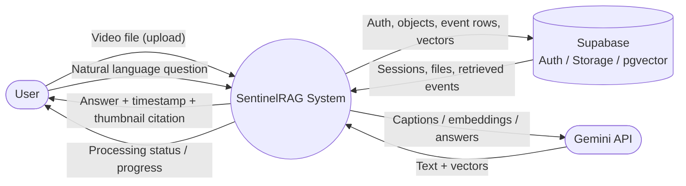
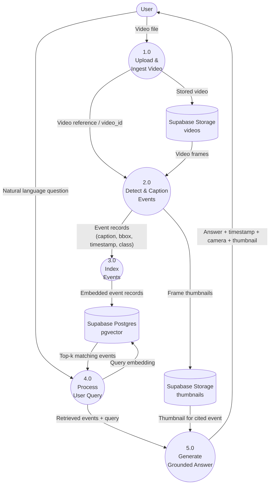
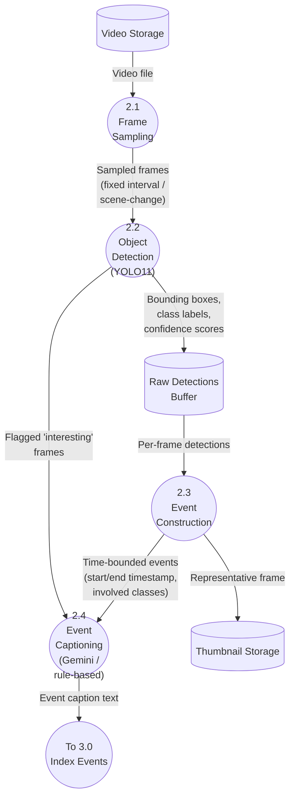
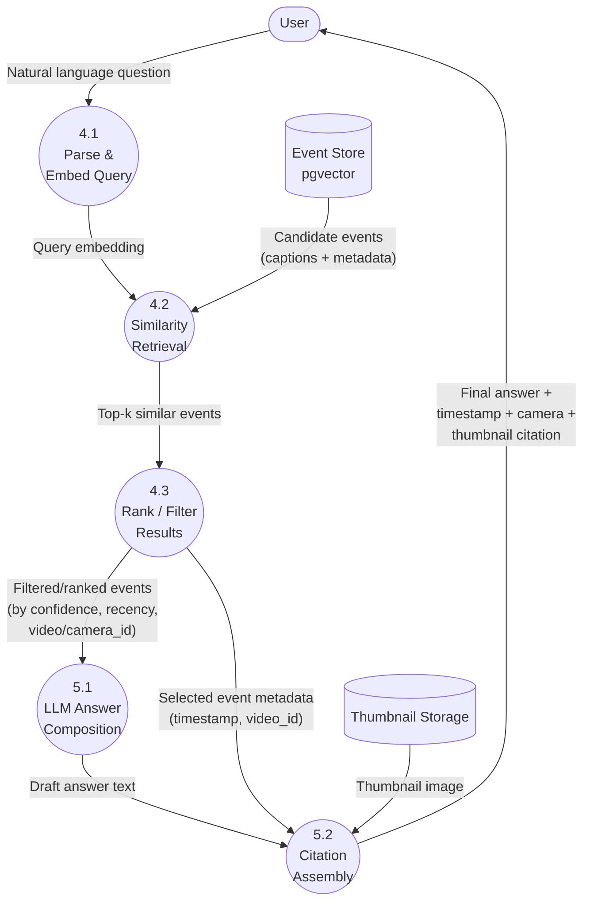

# Data Flow Diagrams — SentinelRAG (Video Surveillance RAG)

This file contains the Level 0 (Context), Level 1 (System Overview), and Level 2 (Detailed Sub-process) Data Flow Diagrams for the project. Diagrams are written in Mermaid so they render directly in GitHub, most IDEs, and Claude/VS Code markdown previews.

Notation used:
- **Rounded rectangle** = Process
- **Rectangle** = External Entity
- **Cylinder** = Data Store
- **Arrow label** = Data Flow

---

## Level 0 — Context Diagram

The system as a single black box, showing only external entities and the data crossing the system boundary.

**Description:** A user uploads a video and later asks natural-language questions. SentinelRAG persists nothing on the laptop: Supabase holds accounts, files, and pgvector rows. Gemini provides vision captions, embeddings, and answers. No live camera feeds.

---

## Level 1 — System-Level DFD

Decomposes the system into its major processes and data stores.

**Description of processes:**
- **1.0 Upload & Ingest Video** — accepts the uploaded file, assigns a `video_id`, stores it.
- **2.0 Detect & Caption Events** — samples frames, runs YOLO11 detection, constructs time-bounded events, generates natural-language captions (Gemini vision, or rule-based fallback).
- **3.0 Index Events** — embeds event captions/metadata and writes them into Supabase Postgres (pgvector).
- **4.0 Process User Query** — embeds the user's question, retrieves the most relevant events from pgvector.
- **5.0 Generate Grounded Answer** — uses an LLM (via LangGraph) to compose a natural-language answer citing timestamp, camera/video ID, and thumbnail.

---

## Level 2 — Detailed Decomposition

### Level 2a — Decomposition of Process 2.0 (Detect & Caption Events)

**Description:**
- **2.1 Frame Sampling** — extracts frames at a fixed interval or via scene-change detection (avoids processing every frame).
- **2.2 Object Detection** — runs YOLO11 on sampled frames; flags frames with meaningful detections for captioning (the two-stage cheap-detector → expensive-captioner design).
- **2.3 Event Construction** — groups consecutive per-frame detections into human-meaningful, time-bounded events.
- **2.4 Event Captioning** — generates a natural-language description per event, using Gemini vision on flagged frames, or a rule-based template as fallback.

---

### Level 2b — Decomposition of Processes 4.0 + 5.0 (Query → Answer)

**Description:**
- **4.1 Parse & Embed Query** — converts the user's natural-language question into a vector embedding.
- **4.2 Similarity Retrieval** — queries pgvector for the most semantically similar indexed events.
- **4.3 Rank / Filter Results** — applies confidence thresholds and any filters (e.g., specific camera/video, time range) before passing results forward.
- **5.1 LLM Answer Composition** — an LLM (orchestrated via LangGraph) drafts a natural-language answer grounded in the retrieved events.
- **5.2 Citation Assembly** — attaches the supporting timestamp, camera/video ID, and thumbnail to the final answer shown to the user.

---

## Notes on Using These Diagrams

- These diagrams assume **Phase 1 (single video)** scope. In Phase 2 (multi-video), Process 1.0 and the data stores gain a `video_id`/`camera_id` dimension that is already accounted for in the schema (see `CLAUDE.md`, Section 6) — no new processes are needed, only multiplicity of the existing ones.
- If you add new pipeline stages (e.g., anomaly scoring, alerting), extend Level 1 first, then add a corresponding Level 2 decomposition — keep this file as the up-to-date structural reference alongside `ARCHITECTURE.md`.
